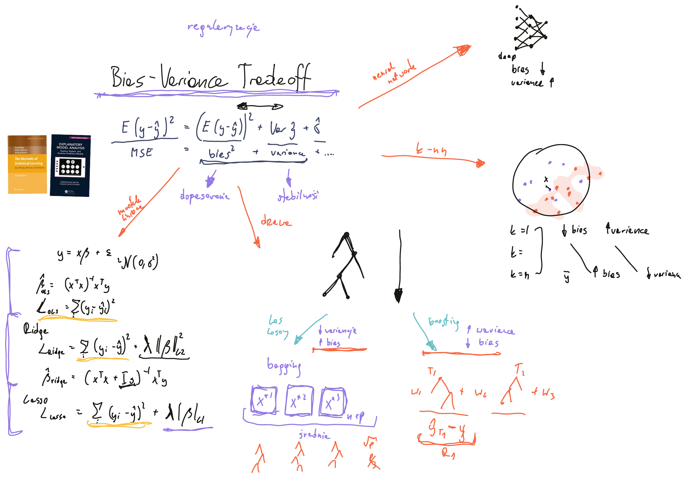

# Bias–variance tradeoff

**Uwaga: za każdy znaleziony merytoryczny błąd będę dawał dodatkowe punkty na obronie!**

<iframe width="560" height="315" src="https://www.youtube.com/embed/eoRvbQ8kW7c" title="YouTube video player" frameborder="0" allow="accelerometer; autoplay; clipboard-write; encrypted-media; gyroscope; picture-in-picture" allowfullscreen></iframe>

## Slajd

## Materiały dodatkowe

* The Elements of Statistical Learning: https://hastie.su.domains/Papers/ESLII.pdf (na początek rozdział 2.9)
* Explanatory Model Analysis: https://ema.drwhy.ai/ (wyprowadzenie jest w rozdziale 2.5 https://ema.drwhy.ai/modelDevelopmentProcess.html#fitting)
* Ridge, LASSO i OLS na palcach i z obrazkami: https://towardsdatascience.com/from-linear-regression-to-ridge-regression-the-lasso-and-the-elastic-net-4eaecaf5f7e6
* Boosting i bagging dla drzew, bez obrazków ale z tabelką: https://www.geeksforgeeks.org/bagging-vs-boosting-in-machine-learning/
* Z obrazkami dla metody k-NN: https://medium.com/30-days-of-machine-learning/day-3-k-nearest-neighbors-and-bias-variance-tradeoff-75f84d515bdb
* Ciekawa praca, czy deep learning podlega tym samym prawom co modele klasyczne? https://arxiv.org/abs/2002.11328
* Obrazki z wikipedii (są często kopiowane do innych blogów w tej tematyce) https://en.wikipedia.org/wiki/Bias%E2%80%93variance_tradeoff

